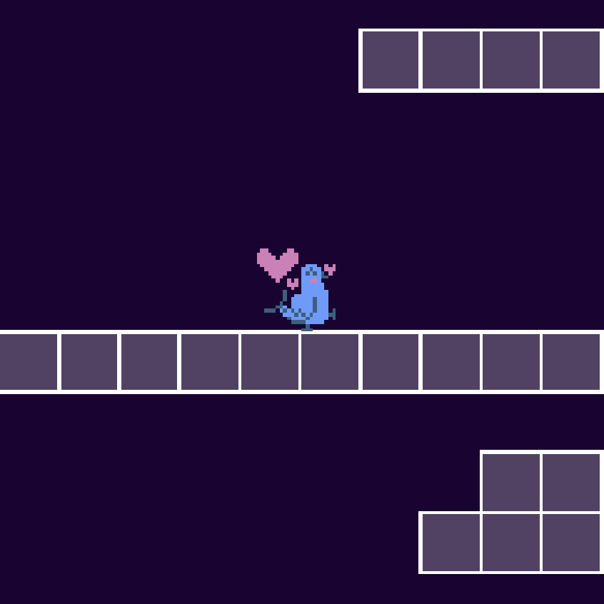

# Hacklahoma Hike

Hacklahoma-themed 2D platformer in a custom game engine!

Wether you play with a controller or a keyboard, can you make it to 99m? Good luck in this Hacklahoma-themed challenge!

> Pssssst... if you ever need a little boost of encouragement, press up for some support from your favorite feathered friend! 🕊️❤️

## Downloads

[MacOS](https://drive.google.com/file/d/1irHWK9AA5oSYaVcFs7iR-GJPrhi36bVo/view?usp=sharing)

[Windows](https://drive.google.com/file/d/1HgDTzN9IuK-sb6i9eRIZU-Lx1yrzDRik/view?usp=sharing)

[Linux](https://drive.google.com/file/d/19zWjYoQPYJC1-HYvxhdqLdaBoMPRriGf/view?usp=sharing)

## Controls

### Movement

| Action     | Keyboard | Controller                  |
| ---------- | -------- | --------------------------- |
| Move Left  | `A`, `←` | Left Stick (left), D-Pad ←  |
| Move Right | `D`, `→` | Left Stick (right), D-Pad → |
| Crouch     | `S`, `↓` | Left Stick (down), D-Pad ↓  |

### Actions

| Action | Keyboard                         | Controller               |
| ------ | -------------------------------- | ------------------------ |
| Jump   | `Space`, `L`                     | `A`, `B`                 |
| Run    | `Left Shift`, `Right Shift`, `K` | `X`, `Y`,                |
| Taunt  | `W`, `↑`                         | Left Stick (up), D-Pad ↑ |

### User Interface

| Action           | Keyboard   | Controller            |
| ---------------- | ---------- | --------------------- |
| Cycle Skin Left  | `-`        | Left Shoulder (`L1`)  |
| Cycle Skin Right | `+`        | Right Shoulder (`R1`) |
| Pause            | `P`, `Esc` | `Start`, `Back`       |

### Camera

| Action      | Controller           |
| ----------- | -------------------- |
| Pan Camera  | Right Stick          |
| Zoom Camera | Right Stick (button) |

## Additional Credits

Special thanks to the [Sheepolution Love2D tutorial](https://sheepolution.com/learn/book/0) for providing a framework and the [sheep image](assets/images/sheep.png).
